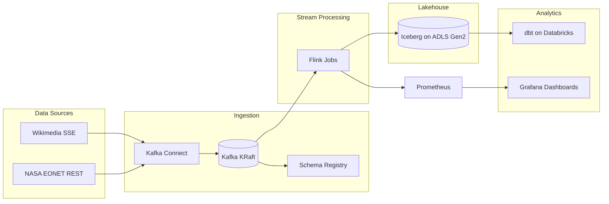

# Vega — Real-Time Streaming Lakehouse Pipeline

Vega tracks global natural events and real-time human reactions to them. A wildfire starts (NASA EONET) → Wikipedia edits spike → Vega captures the correlation live.

## Architecture



## Tech Stack

Java 21 · Kafka 3.7 (KRaft) · Flink 1.20 · Apache Iceberg 1.6 · Azure ADLS Gen2 · Databricks · dbt · Terraform · Prometheus · Grafana

## Data Sources

| Source | Type | Status |
|---|---|---|
| Wikimedia EventStreams | SSE (real-time) | Active |
| NASA EONET | REST polling (60s) | Active |
| Sri Lanka RSS Feeds (Lanka Lens) | RSS polling (5m) | Active |

## Project Structure

- `connectors/wikimedia/` — SSE Kafka source connector
- `connectors/slnews/` — Sri Lanka RSS Kafka source connector (Lanka Lens)
- `flink-jobs/` — Five Flink stream processing jobs
- `iceberg/schemas/` — Iceberg table DDL
- `dbt/` — Databricks analytics models
- `k8s/` — AKS production manifests
- `terraform/` — Azure infrastructure
- `dashboards/grafana/` — Live pipeline dashboards

## Quick Start

```bash
# Build connectors and Flink jobs
cd connectors/wikimedia && mvn package -DskipTests && cd ../..
cd connectors/eonet && mvn package -DskipTests && cd ../..
cd flink-jobs && mvn package -DskipTests && cd ..

# Start the core stack (Kafka, Flink, Schema Registry, Kafka UI)
make up

# Deploy Kafka Connect sources
curl -X POST http://localhost:8083/connectors -H "Content-Type: application/json" -d '{
  "name": "wikimedia-source",
  "config": {
    "connector.class": "io.vega.connector.wikimedia.WikimediaSourceConnector",
    "tasks.max": "1",
    "topic": "raw-wiki-events"
  }
}'

curl -X POST http://localhost:8083/connectors -H "Content-Type: application/json" -d '{
  "name": "eonet-source",
  "config": {
    "connector.class": "io.vega.connector.eonet.EONETSourceConnector",
    "tasks.max": "1",
    "topic": "raw-natural-events"
  }
}'

curl -X POST http://localhost:8083/connectors -H "Content-Type: application/json" -d '{
  "name": "slnews-source",
  "config": {
    "connector.class": "io.vega.connector.slnews.SLNewsSourceConnector",
    "tasks.max": "1",
    "topic": "raw-sl-news"
  }
}'

# Submit Flink jobs
./scripts/submit-jobs.sh

# Start monitoring (Prometheus, Grafana)
make monitoring
```

### Endpoints

| Service | URL |
|---|---|
| Kafka UI | http://localhost:8080 |
| Flink UI | http://localhost:8081 |
| Schema Registry | http://localhost:8082 |
| Kafka Connect | http://localhost:8083 |
| Prometheus | http://localhost:9090 |
| Grafana | http://localhost:3000 |

Copy `.env.example` to `.env` and configure environment variables for production deployments.

## License

MIT
