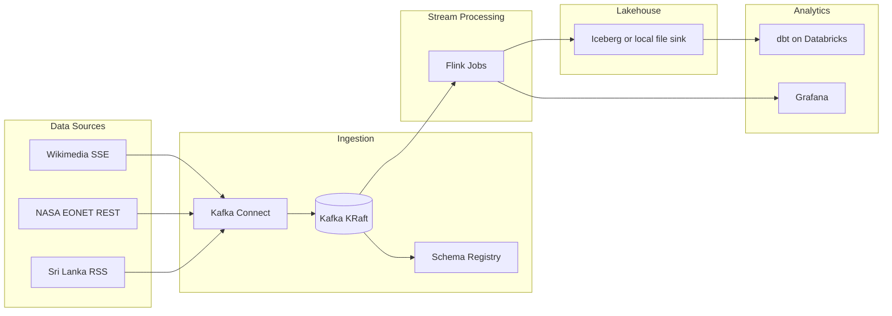

# Vega — streaming lakehouse sandbox

[](https://github.com/Cookie-Cat21/Vega/actions/workflows/test-all.yml)

Correlates natural events (NASA EONET), Wikimedia edit spikes, and Sri Lanka news through Kafka → Flink → Iceberg (or a local file sink).

> **Portfolio / learning system.** Demonstrates streaming lakehouse mechanics locally (and Azure scaffolding). Not a production SLA product.

## Architecture


```mermaid
flowchart LR
    subgraph sources [Data Sources]
        Wiki[Wikimedia SSE]
        EONET[NASA EONET REST]
        SLNews[Sri Lanka RSS]
    end

    subgraph ingest [Ingestion]
        KC[Kafka Connect]
        Kafka[(Kafka KRaft)]
        SR[Schema Registry]
    end

    subgraph process [Stream Processing]
        Flink[Flink Jobs]
    end

    subgraph storage [Lakehouse]
        Sink[Iceberg or local file sink]
    end

    subgraph analytics [Analytics]
        DBT[dbt on Databricks]
        Grafana[Grafana]
    end

    Wiki --> KC
    EONET --> KC
    SLNews --> KC
    KC --> Kafka
    Kafka --> SR
    Kafka --> Flink
    Flink --> Sink
    Sink --> DBT
    Flink --> Grafana
```

Local default: Flink writes to a **file sink** under `./data/vega-output` (`VEGA_ICEBERG_ENABLED=false`). Iceberg on ADLS Gen2 is scaffolded and needs Azure credentials.

## Tech stack

| Layer | Tech |
|---|---|
| Language | Java 21 |
| Ingest | Kafka Connect source connectors (Avro) |
| Broker | Kafka KRaft (Compose: Confluent 7.6) |
| Processing | Apache Flink 1.20 |
| Lakehouse | Apache Iceberg (optional) / local file sink |
| Analytics | dbt + Databricks (cloud) |
| Infra scaffolding | Terraform, AKS manifests, Helm |
| Observability | Prometheus, Grafana |

## Data sources

| Source | Type | Cadence |
|---|---|---|
| Wikimedia EventStreams | SSE | continuous |
| NASA EONET | REST poll | ~60s |
| Sri Lanka RSS (Lanka Lens) | RSS poll | ~5m |

## Project structure

```
connectors/          Kafka Connect sources (wikimedia, eonet, slnews)
flink-jobs/          Six Flink DataStream jobs + tests
iceberg/schemas/     Iceberg table DDL
dbt/                 Databricks analytics models
docker-compose.yml   Local Kafka / Connect / Flink stack
scripts/             Bootstrap, demo, register, submit helpers
terraform/           Azure infra scaffolding
k8s/ helm/           AKS-oriented manifests
docs/                Architecture, runbook, failure modes, local demo
```

## Quick start

Prerequisites: Java 21, Maven 3.9+, Docker Compose v2.

```bash
cp .env.example .env

# Build connector + Flink JARs, start Compose, register connectors, submit jobs
make bootstrap

# Or step by step:
make build
make up
make register-connectors
make submit-jobs
```

Bounded local proof (no live Wikimedia required) — fixtures → Flink → file sink:

```bash
make demo
```

Optional monitoring:

```bash
make monitoring
```

### Endpoints

| Service | URL |
|---|---|
| Kafka UI | http://localhost:8080 |
| Flink UI | http://localhost:8081 |
| Schema Registry | http://localhost:8082 |
| Kafka Connect | http://localhost:8083 |
| Prometheus | http://localhost:9090 |
| Grafana | http://localhost:3000 (`admin` / `vega`) |

## How to verify

1. **Kafka UI** (`http://localhost:8080`) — topics such as `raw-wiki-events` show messages (live connectors or `make demo` fixtures).
2. **Flink UI** (`http://localhost:8081`) — jobs listed as running (e.g. `WikiEnrichmentJob`).
3. **Sink path** — with Iceberg disabled (default), rows land under `./data/vega-output/<table>/`. `make demo` asserts this automatically.
4. **dbt (optional)** — `cd dbt && dbt compile` with `DATABRICKS_HOST`, `DATABRICKS_HTTP_PATH`, `DATABRICKS_TOKEN` set (placeholders work for compile-only CI).

See [`docs/LOCAL_DEMO.md`](docs/LOCAL_DEMO.md) for the step-by-step path.

## Tests & CI

| Workflow | What it covers |
|---|---|
| [`test-all.yml`](.github/workflows/test-all.yml) | Maven unit tests for all connectors + `flink-jobs` |
| `build-*-connector.yml` / `build-flink-jobs.yml` | Per-module package |
| `compose-validate.yml` | `docker compose config` |
| `terraform-validate.yml` | `terraform validate` (no apply) |
| `dbt-compile.yml` | `dbt compile` with placeholder Databricks env |
| `deploy-to-aks.yml` | AKS deploy — **requires Azure secrets**; expect failure without them |

```bash
make test
make validate
```

CI does **not** run a full live Wikimedia → Iceberg E2E. Prefer `make demo` locally for a bounded data-movement check.

## Trade-offs / known gaps

- **Cloud deploy needs secrets** — Terraform apply and `deploy-to-aks.yml` are scaffolding until Azure credentials exist.
- **dbt env names** — `dbt/profiles.yml` expects `DATABRICKS_*` (not `DBT_DATABRICKS_*`). CI is aligned to the non-prefixed names.
- **Shallow / disabled tests** — `*IT.java` integration stubs are `@Disabled` and not asserted in CI.
- **DLQ** — `DeadLetterPublisher` exists in connector modules but is not wired from source tasks yet.
- **Local lakehouse** — no MinIO in Compose; default proof path is the Flink file sink. Real Iceberg on ADLS needs `VEGA_ICEBERG_ENABLED=true` and Azure OAuth.
- **Live connectors** — Wikimedia/EONET/RSS need egress; use `make demo` fixtures when offline.

## Next hardening

1. Wire connector DLQ publishing on parse failures and add a Connect smoke assertion in CI.
2. Add a local object-store stand-in (e.g. MinIO) for Iceberg without Azure.
3. Enable one bounded integration test that runs under Compose in CI.

## Docs

- [`docs/ARCHITECTURE.md`](docs/ARCHITECTURE.md) — data flow and job map
- [`docs/LOCAL_DEMO.md`](docs/LOCAL_DEMO.md) — verification walkthrough
- [`docs/FAILURE_MODES.md`](docs/FAILURE_MODES.md) — duplicates, late events, DLQ, checkpoints
- [`docs/AUDIT.md`](docs/AUDIT.md) — detox audit notes

## License

MIT
