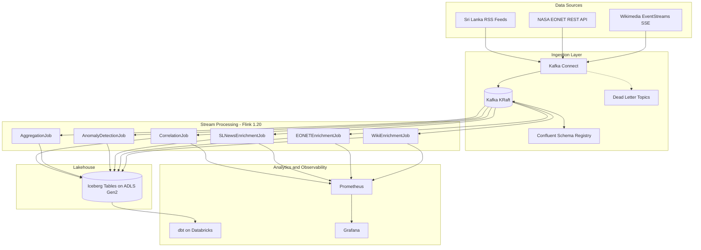
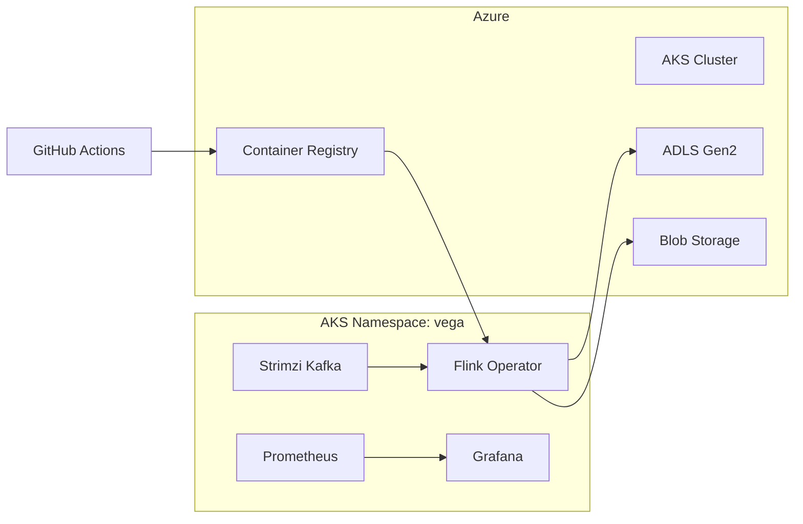

# Vega Architecture

Vega is a streaming lakehouse **sandbox** that correlates natural events with Wikipedia edit activity and Sri Lanka news. Locally it runs on Docker Compose (Kafka → Flink → file sink or optional Iceberg). Azure ADLS, AKS, and Databricks pieces are scaffolding and need credentials to operate.

## High-Level Data Flow

## Ingestion Layer

### Kafka Connect Source Connectors

Each data source is implemented as a custom Java Kafka Connect source connector:

| Connector | Package | Kafka Topic | Protocol |
|---|---|---|---|
| Wikimedia | `connectors/wikimedia` | `raw-wiki-events` | SSE (persistent stream) |
| NASA EONET | `connectors/eonet` | `raw-natural-events` | REST polling (60s) |
| Lanka Lens / SL News | `connectors/slnews` | `raw-sl-news` | RSS polling (5m) |

All connectors serialize records with Avro schemas registered in Confluent Schema Registry. A shared `DeadLetterPublisher` utility exists in each connector module for routing bad payloads to `vega-dead-letter`, but source tasks do not call it yet — treat DLQ as planned wiring, not a live guarantee.

### Kafka Topics

| Topic | Schema | Producer | Consumers |
|---|---|---|---|
| `raw-wiki-events` | `WikiEvent.avsc` | Wikimedia connector | WikiEnrichmentJob, AnomalyDetectionJob, AggregationJob, CorrelationJob |
| `raw-natural-events` | `NaturalEvent.avsc` | EONET connector | EONETEnrichmentJob, CorrelationJob |
| `raw-sl-news` | `SLNewsArticle.avsc` | SL News connector | SLNewsEnrichmentJob |

## Stream Processing Layer

Six Flink jobs run on the DataStream API with exactly-once checkpointing:

### WikiEnrichmentJob

Consumes `raw-wiki-events`, enriches each edit with `editSizeDelta`, `languageGroup`, and `isNewArticle`, writes to `wiki_events_enriched`.

### EONETEnrichmentJob

Consumes `raw-natural-events`, adds `regionName` (static geo lookup) and `severityLabel`, writes to `natural_events`.

### SLNewsEnrichmentJob

Consumes `raw-sl-news`, enriches articles with source metadata and language tags, writes to `sl_news_articles`.

### AnomalyDetectionJob

Detects large edits (>10,000 characters) and rapid edit bursts (>5 edits in 60 seconds per user), writes to `edit_anomalies`.

### AggregationJob

1-minute tumbling windows keyed by wiki, producing `totalEdits`, `botEdits`, `humanEdits`, and `avgEditSize` into `edit_aggregates`.

### CorrelationJob

The flagship job. Joins natural events with wiki edits by keyword matching on article titles within a 30-minute event-time window. Computes reaction time (seconds from disaster to first matching Wikipedia edit). Writes to `event_correlations` and emits `vega_event_correlations_total` metrics.

## Storage Layer

Iceberg tables are defined in `iceberg/schemas/` and written by Flink via `IcebergSinkFactory`:

| Table | Partition Key | Primary Use |
|---|---|---|
| `wiki_events_enriched` | `date(timestamp)` | Edit analytics |
| `natural_events` | `category` | Disaster tracking |
| `edit_anomalies` | `date(timestamp)` | Anomaly alerting |
| `edit_aggregates` | `date(window_start)` | Throughput metrics |
| `event_correlations` | `date(window_start)` | Reaction time analysis |
| `sl_news_enriched` | `date(published_at)` | Regional news coverage |

Local default (`VEGA_ICEBERG_ENABLED=false`) writes Flink output to a file sink under `./data/vega-output`. With Iceberg enabled, a Hadoop catalog warehouse defaults to `/tmp/iceberg/warehouse`; ADLS Gen2 (`abfs://`) needs Azure OAuth env vars.

## Analytics Layer

dbt models in `dbt/` transform Iceberg tables into marts:

- **Staging** — type casting and light cleaning (`stg_wiki_events`, `stg_natural_events`)
- **Marts** — `edit_velocity_by_wiki`, `top_edited_articles`, `bot_vs_human_ratio`, `natural_events_by_type`, `event_reaction_time`

## Infrastructure

| Environment | Orchestration | Provisioning |
|---|---|---|
| Local | Docker Compose | `make up` / `make bootstrap` / `make demo` |
| Cloud scaffolding | AKS + Strimzi + Flink Operator | Terraform + GitHub Actions (secrets required) |

Terraform (`terraform/`) provisions AKS, ADLS Gen2, Azure Blob (checkpoints), ACR, and networking. Kubernetes manifests in `k8s/` define Strimzi Kafka, Schema Registry, Flink deployments, and monitoring.

## Observability

Prometheus scrapes Flink TaskManagers, Kafka brokers, and Schema Registry. Alert rules in `prometheus/alert-rules.yml` cover consumer lag, checkpoint failures, ingest stalls (per source), JVM heap, and Flink job health. Grafana dashboards in `dashboards/grafana/` visualize pipeline throughput, correlations, and JVM metrics.

Flink operators expose custom metrics via `CountingMapper`, `CountingFilter`, and `CorrelationMetricsSink` under the `vega` metric group.

## Deployment Topology (Azure scaffolding)

## Key Design Decisions

1. **Avro-first contracts** — Schema Registry enforces compatibility across connectors, Flink jobs, and Iceberg tables.
2. **DataStream API only** — No Flink Table API; all jobs use explicit operators for testability and tuning.
3. **Checkpointed Flink jobs** — Compose uses local checkpoint dirs; Azure Blob checkpoints are for the AKS path.
4. **Virtual threads** — HTTP clients in connectors use Java 21 virtual threads for efficient I/O.
5. **DLQ utility present** — `DeadLetterPublisher` is ready to wire; not yet invoked from source tasks.
